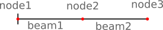
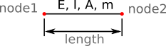
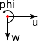

# Model

A simple FE-Model is used for the computation.
The model consists of multiple beams. 
Beams are connected by nodes.

A single beam is defined by:

- start, end node
- length
- area, *A*
- elastic modulus, *E*
- area moment of inertia, *I*
- mass, *m*

## Units
The tool works unit independent. That means all values must 
be provided in compatible units - for instance: 

- if length is in *m* then *A* must be in *m2*
- if mass is in *kg* and length in *m*, then gravity must be in 
  *m/s2* and forces in *N*.

## Coordinate Systems
The overall coordinate system (CSYS) is shown below. The beam axis is *x*.

Nodes have their own CSYS according to the below figure.

Both systems overlay:

- *x* = *u*
- *z* = *w*
- rotation around *y* = *phi*

## Beam Types
Available beam types are:

- `B_2DOF`
    - Bernoulli beam 
    - start and end node with 2 DOF: *w*, *phi*

- `B_2DOF_II` 
    - Bernoulli beam 
    - start and end node with 2 DOF: *w*, *phi* 
    - support of *pDelta* effects

Best option is to use `B_2DOF_II` for all computations as allows
to toggle the *pDelta* effect on and off without modification of the
model definition.

> **Note:** Beam types cannot be mixed within a model.

## Mass Elements
Masses are defined by:

- coordinate on the x-axis: `"x"`
- mass value: `"mass"`
- mass moment of inertia: `"mmoi"`

Masses are assigned to the node closest to the specified *x*-coordinate.
It is allowed to define multiple masses at the same location *x*; 
their effect will be combined.

## Springs
Springs are defined by:

- coordinate on the x-axis: `"x"`
- translational spring value: `"w"`
- rotational spring value: `"phi"`

Springs must be defined at exact node locations.

## Boundary Conditions
Boundary conditions are defined by:

- coordinate on the x-axis: `"x"`
- value for: `"w": 0.0`, `"phi": 0.0`

Boundary conditions must be defined at exact node locations. Values must
be set to `0.0`, otherwise the BC will not be applied correctly.

> **Note**: It is allowed to define springs and BC for 
> the same node (`x`-location). However, the BC will 
> always override the spring.
